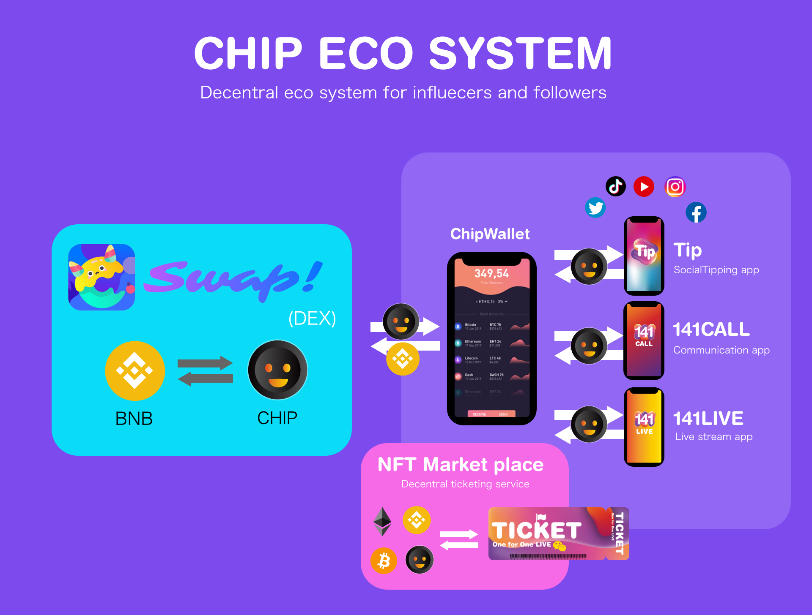
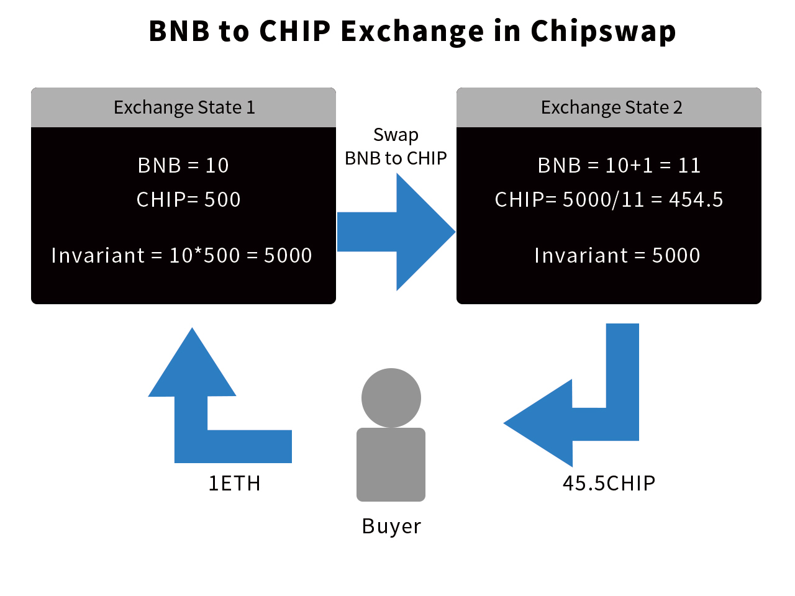
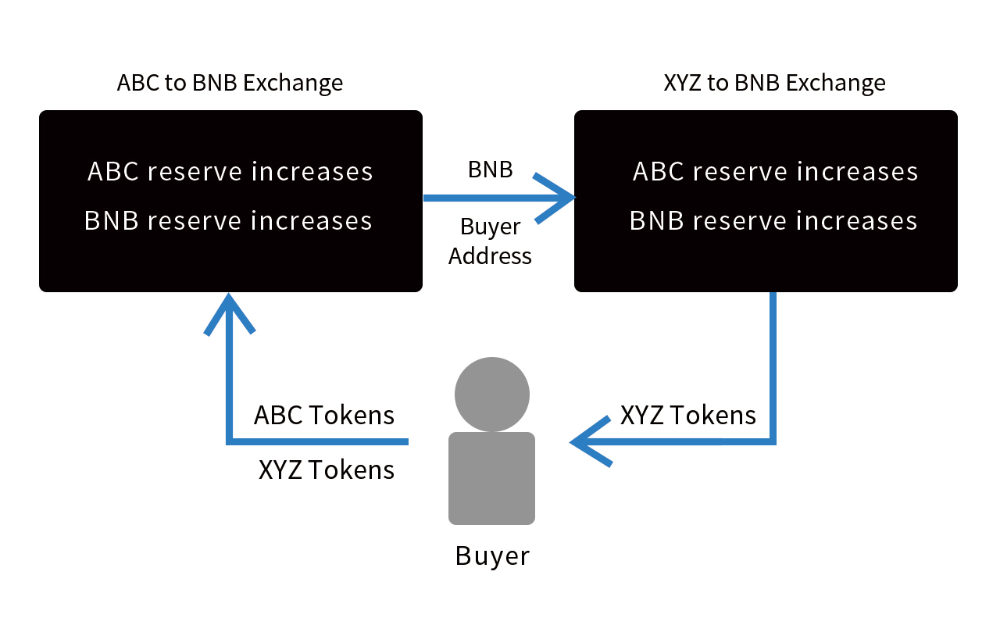

# Chipswap Documentation

As a venue for pooled, automated liquidity provision on Binance Smart Chain, the Chipswap protocol (Chipswap) functions without upkeep, providing an unstoppable platform for BEP20 token conversion. 

Chipswap is a Uniswap-based DEX that is designed to accelerate the influencer economy.

*This document was written when the product was still under development.*
*There is a possibility of changing to Ethereum.*

## Introduction

It was surprising that Uniswap and Sushiswap revolutionized decentralized finance and automated market making, surpassing Coinbase in daily trading volumes in early September.

But there was a price to pay for this.
All gas fee hit record highs.
This makes it nearly impossible for ordinary traders to participate in ERC20 smart contract-based DeFi applications and governance.

So the DeFi revolution must be sustainable.
Binance said, Sushi is considered an elite food, but hamburgers are for everyone.

So we enter into decentralized finance to expand the influencer's eco-system.
DeFi - Decentralized finance - is a rapidly growing field.

So this is another project, but we have created a decentralized exchange (DEX) with my partners.

The purpose of joining the project is to digitize the value of influencers, individuals and people around the world. A market where the community lists governance human tokens.
The community has governance, yield farming, liquidity mining, and will be deployed in the Binance Smart Chain. Chainlinks and hash graphs can help us.

Tokyo Olympics and Osaka Expo will be held.
After Corona is a digital bubble era, so I hope you will know what is happening in the center of this bubble era.
In order to scale up 141 Project, social tipping and previous projects, there is no way not to get on this DeFi bubble.

We implement the Binance-recommended Uniswap and Sushiswap business models.
If you're familiar with technology, you'll find out what this is all about, and it's like a machine to increase the value of cryptocurrencies.

### What do we do?

For example, the relationship between employees and companies, affiliates and affiliate centers, influencers and SNS, the platform side is more profitable than the player side.
The same is true for web services. The platform iphone is more profitable than the app, and it depends on Apple, so Apple is the most profitable as a result.

Similarly, it's more profitable in the post-scale-up phase to provide a social-tipping platform for all social networks than to build original live apps like 17LIVE and Twitcasting, which rely on gifting for sales.

TIP can social-tip to all SNS such as Instagram, 17 live, Twitter tweets and tiktok accounts.
It is an application that provides a place.

### Understand TIP first

Justin Bieber token and Rafael token will be automatically issued immediately as child tokens of chips, and listing and trading will be realized.

A machine that boosts chip coins and various human coins is a decentralized exchange called chip swap with yield farming and liquidity mining.

First, we will release Chip Coin and Chip Swap Exchange.
At the same time we list chip coins on the chip swap exchange.

Users can get listed tip coins faster than anywhere else on the tip swap exchange.
This is because when the price of chip coins is low, we collect investors who want to get chip coins early and sell them when they are high to make a profit.

Investors pool their assets and get a full return with no loss of assets (synonymous with principal guarantee), plus transaction fees and liquidity mining fees.

In addition, tip coins will be returned depending on the pool amount.
This mechanism is the business model of DeFi's decentralized exchange, which is now very popular in the United States.

We have plans to provide decentralized exchanges, crypto assets, cross-SNS Social Tipping apps, unique live streaming services, etc. to society, including those that have already been released.

We will use blockchain and technology to build a new eco-system in which SNS influencers and individuals play a leading role, and bring about next-generation innovation.

It is an application with the same model as TIP, and it is this application that you can gift points named coins used for various in-game billing.

[https://apps.apple.com/jp/app/powder-edit-video-game-clips/id1490570461](https://apps.apple.com/jp/app/powder-edit-video-game-clips/id1490570461)

ESPN is a live app that broadcasts basketball games and allows viewers to do Social Tipping each time a successful dunk shot.

[https://apps.apple.com/jp/app/espn-live-sports-scores/id317469184](https://apps.apple.com/jp/app/espn-live-sports-scores/id317469184)

We turned to a new service that matched the Covit-19 era.

[https://markets.businessinsider.com/news/stocks/141live-brings-a-unique-influencer-platform-changing-live-streaming-and-video-calling-as-we-know-it-1029370871](https://markets.businessinsider.com/news/stocks/141live-brings-a-unique-influencer-platform-changing-live-streaming-and-video-calling-as-we-know-it-1029370871)

### Our live streaming service

141LIVE
3000 influencers from Japan have joined.

[https://141live.jp/en](https://141live.jp/en)

### Mission

Digitize personal value, DeFi Decentralized Exchange Chip Swap creates a SocialTipping economy that crosses various existing SNS services in addition to its own live streaming service and allows all SNS users to pay with crypto assets.

Tokenize influencers, the name is HumanToken.
Followers have the Governance.

To increase the influencer's token value, followers pool their assets in a Chipswap fully automated liquidity protocol to make money by mining for influencers and the community, for other followers and for themselves.

Token owners and followers should join each influencer's crypto community.

Join the influencer community with different NFT, depending on your membership level.  Influencer value is a human token.  The overall value of human tokens affects the value of chip tokens.  In other words, chips and humans are parents and children.  Chips are widely distributed in the Chip Token Economy.

And with the advent of TIP, it will be possible to distribute to all SNS.
This is the whole picture of our ideal new SocialTipping economy.

## How it works

Chipswap is an automated liquidity protocol powered by a constant product formula and implemented in a system of non-upgradeable smart contracts on the Binance Smart Chain. It obviates the need for trusted intermediaries, prioritizing decentralization, censorship resistance, and security.

Each Chipswap smart contract, or pair, manages a liquidity pool made up of reserves of two BEP20 tokens.

Anyone can become a liquidity provider for a pool by depositing an equivalent value of each underlying token in return for pool tokens. These tokens track pro-rata LP shares of the total reserves, and can be redeemed for the underlying assets at any time.

## Pricing

Pairs act as automated market makers, standing ready to accept one token for the other as long as the “constant product” formula is preserved. This formula, most simply expressed as x * y = k, states that trades must not change the product (k) of a pair’s reserve balances (x and y). Because k remains unchanged from the reference frame of a trade, it is often referred to as the invariant. This formula has the desirable property that larger trades (relative to reserves) execute at exponentially worse rates than smaller ones.

Because the relative price of the two pair assets can only be changed through trading, divergences between the Chipswap price and external prices create arbitrage opportunities. This mechanism ensures that Chipswap prices always trend toward the market-clearing price.

## Fee

In practice, Chipswap applies a 0.30% fee to trades, which is added to reserves. As a result, each trade actually increases k. This functions as a payout to LPs, which is realized when they burn their pool tokens to withdraw their portion of total reserves.

## Ecosystem

The Chipswap ecosystem is primarily comprised of three types of users: liquidity providers, traders, and developers. Liquidity providers are incentivized to contribute BEP20 tokens to common liquidity pools. Traders can swap these tokens for one another for a fixed 0.30% fee (which goes to liquidity providers). Developers can integrate directly with Chipswap smart contracts to power new and exciting interactions with tokens, trading interfaces, retail experiences, and more.

In total, interactions between these classes create a positive feedback loop, fueling digital economies by defining a common language through which tokens can be pooled, traded and used.

## Reference

 - [Participants](overview/Participants.md)
 - [Smart Contracts](overview/SmartContracts.md)

